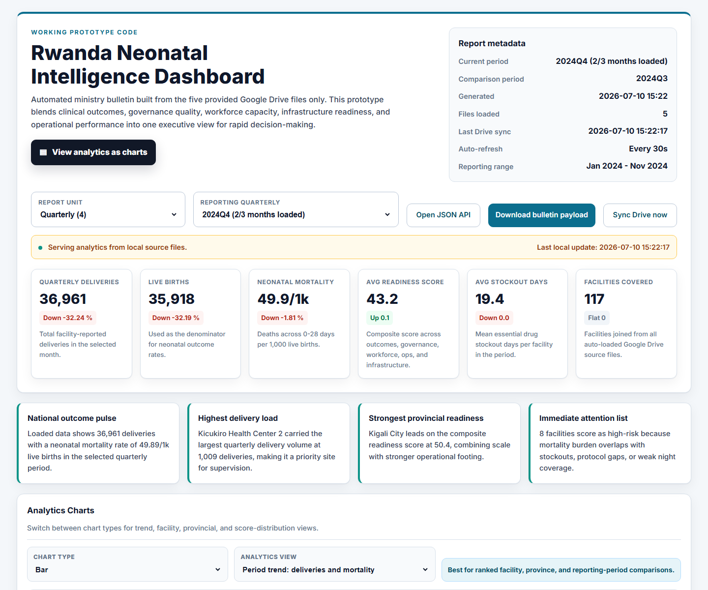
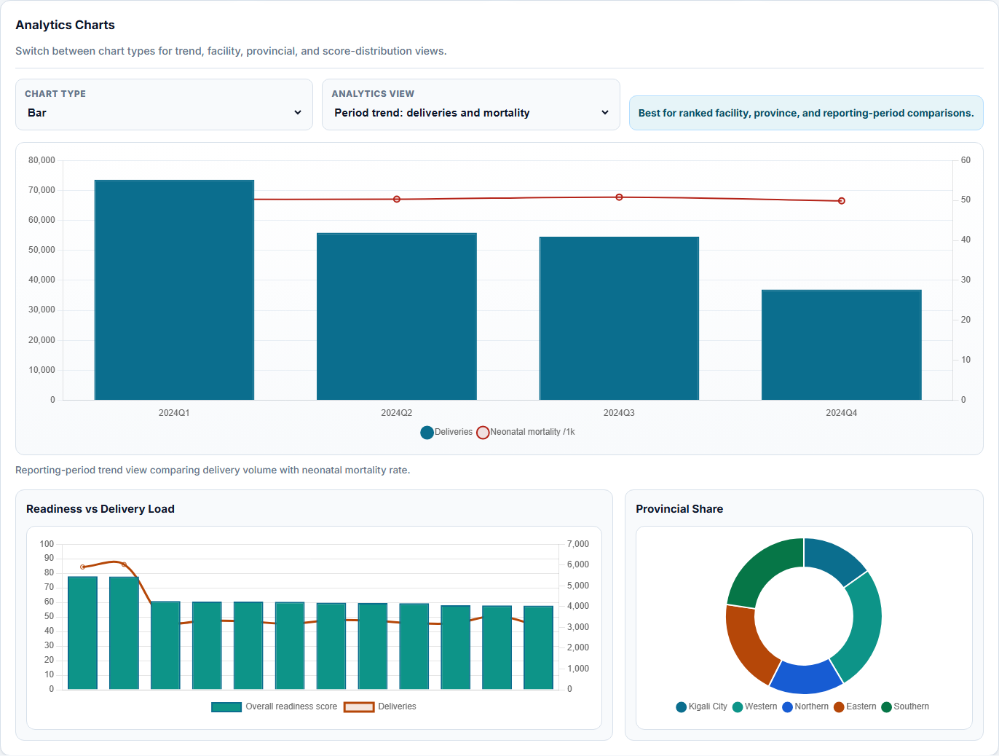
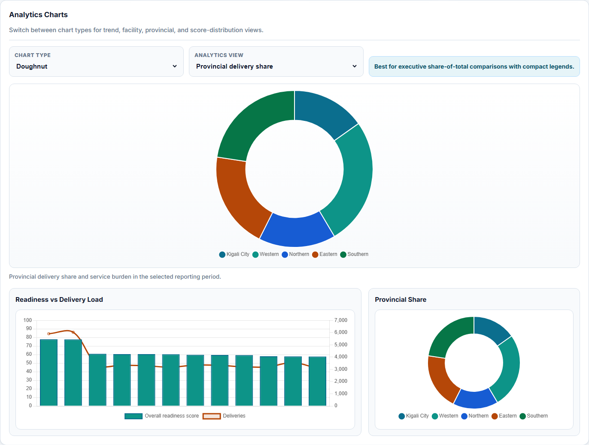
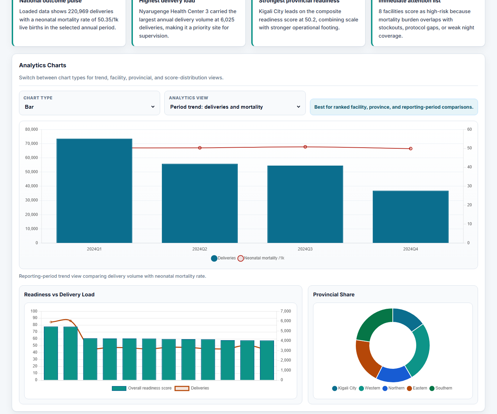
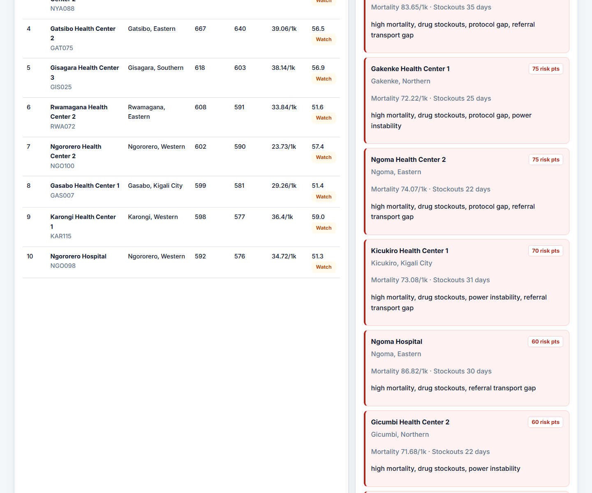

# Sand Healthcare FDE Assignment - Advanced Bulletin Prototype

Submission by **Phillimon Murebwa** for the Sand Healthcare Forward Deployed Engineer assignment.

This Django prototype automates the Quarterly Health Bulletin workflow from the provided DHIS2-like healthcare source files. It proves the core FDE sprint: ingest messy health data, normalize it into a HealthOS-style reporting model, calculate bulletin metrics, and output a usable executive dashboard plus JSON/export payloads.

## Final Submission Files

Final assignment document:

- `Phillimon_Murebwa_Sand_Healthcare_FDE_Assignment_Submission.pdf`

## Live Demo

Render deployment:

[https://fde-zambia-assig-phillimon.onrender.com/](https://fde-zambia-assig-phillimon.onrender.com/)

## Data Source

The app uses the provided Google Drive folder as the source of truth:

[https://drive.google.com/drive/folders/1DPk6jKSO_bbnhonUX6S91kLWZVulWTmA](https://drive.google.com/drive/folders/1DPk6jKSO_bbnhonUX6S91kLWZVulWTmA)

Files available in that Drive folder at development time:

- `clinical_neonatal.csv`
- `facilities.csv`
- `governance.csv`
- `healthcare_workers.csv`
- `operations.csv`

Local development copies are stored in `data/google_drive_source/`.

## What The Prototype Does

- Reads the five provided Google Drive source files.
- Supports `csv`, `xls`, and `xlsx` source files.
- Auto-syncs the Google Drive folder with local-cache fallback.
- Classifies source files by filename and column signatures.
- Joins clinical, facility, governance, workforce, operations, and supplemental facility-level data.
- Supports advanced report filtering from the lowest reporting unit upward:
  - Monthly source rows
  - Quarterly rollups
  - Annual rollups
- Recalculates rates from summed numerators and denominators instead of averaging rates.
- Flags partial reporting periods when not all expected months are loaded.
- Calculates bulletin metrics including:
  - Top facilities by delivery volume
  - Maternal and neonatal indicators
  - Facility performance/readiness scores
  - Provincial performance overview
  - Monthly, quarterly, and annual trend analysis
  - Interactive analytics charts with bar, line, area, histogram, pie, and doughnut views
  - Mixed readiness-vs-delivery and provincial share charts powered by Chart.js
  - MoM, QoQ, and YoY comparisons
  - Risk watchlist for intervention prioritization
  - Annualized forecasts and reporting completeness

## Outputs

- HTML dashboard: `/`
- JSON API: `/api/bulletin/`
- Downloadable JSON export: `/export/`
- Chart analytics are embedded in the dashboard and use the same report payload as the JSON API.
- Final assignment PDF: `Phillimon_Murebwa_Sand_Healthcare_FDE_Assignment_Submission.pdf`

## Dashboard Screenshots

These are real screenshots captured from the running Django dashboard with Playwright.











Useful demo URLs after starting the server:

- Render dashboard: `https://fde-zambia-assig-phillimon.onrender.com/`
- Quarterly dashboard: `http://127.0.0.1:8000/?granularity=Q&period=2024Q4`
- Annual rollup dashboard: `http://127.0.0.1:8000/?granularity=A&period=2024`
- Annual JSON API: `http://127.0.0.1:8000/api/bulletin/?granularity=A&period=2024`

## Setup

```bash
cd sand-fde-assignment
python -m venv .venv

# Windows
.venv\Scripts\activate

pip install -r requirements.txt
python manage.py migrate
python manage.py test
python manage.py runserver
```

Open `http://127.0.0.1:8000/` in your browser.

## Project Structure

```text
sand-fde-assignment/
|-- bulletin/
|   |-- services.py                 # Drive sync, joins, filtering, scoring, rollups, metrics
|   |-- views.py                    # Dashboard, JSON API, export endpoints
|   |-- tests.py                    # Service and API tests
|   `-- templates/bulletin/
|       `-- dashboard.html          # Executive dashboard UI
|-- data/
|   `-- google_drive_source/        # Local copies of the provided Drive files
|-- health_bulletin/                # Django project settings
|-- submission_assets/              # Screenshots and extracted assignment prompt
|-- Phillimon_Murebwa_Sand_Healthcare_FDE_Assignment_Submission.pdf
|-- manage.py
|-- requirements.txt
`-- README.md
```

## Validation

Run the full test suite:

```bash
python manage.py test
```

Current expected result:

```text
Found 12 test(s).
System check identified no issues.
OK
```

## Key Assumptions

- The provided Google Drive folder stands in for the production DHIS2 ingestion layer.
- Monthly clinical rows are the lowest reliable reporting unit.
- Quarterly and annual reports are generated by rolling up monthly rows.
- Partial quarters are valid but must be labelled clearly.
- Composite readiness scoring is transparent and intended for MoH stakeholder review.
- Authentication, scheduled production orchestration, official PDF distribution, and full Superset registration are production-hardening items.

## Production Path

The final assignment document describes the production path in detail. In short:

- Replace Drive/CSV sync with a scheduled DHIS2 API connector through HealthOS.
- Persist normalized tables in HealthOS Data Models.
- Register approved datasets in the Analytics Template Toolkit / Superset.
- Use Health Insight Engine for anomaly detection and alerting.
- Use Health Atlas for facility and provincial geospatial intelligence.
- Add MoH SSO, row-level access, audit logs, observability, and official PDF/Word bulletin distribution.
